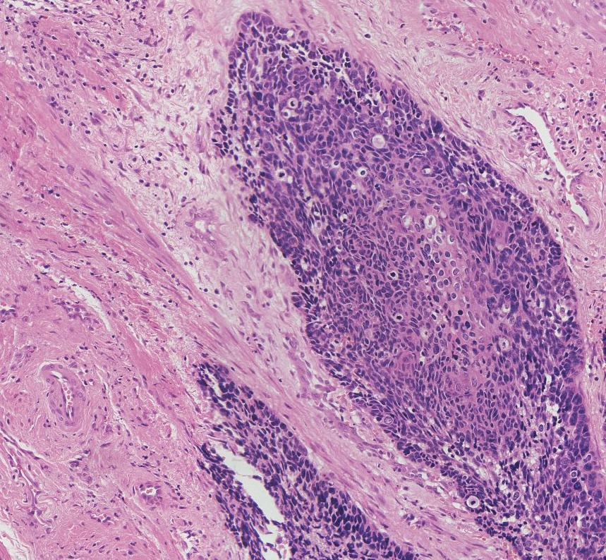

# Pytorch Implementation of TexSem-Net

This repo is implementation for TexSem-Net in pytorch.

The manuscript is currently undergoing review, and the complete source code repository will be made publicly available through our institutional archive upon formal publication of the paper.

## Dataset
The dataset is available at https://drive.google.com/drive/folders/1bq8VS7r6Cn9dYqieGe-VzjQYu5dxW9B6

example:

 


## Citation
If you find this repo useful in your research, please consider citing it and our other works:
```
@InProceedings{10.1007/978-3-031-68639-9_8,
author="Di Giammarco, Marcello
and Mercaldo, Francesco
and Zhou, Xiaoli
and Huang, Pan
and Santone, Antonella
and Cesarelli, Mario
and Martinelli, Fabio",
editor="Mahmud, Mufti
and Ben-Abdallah, Hanene
and Kaiser, M. Shamim
and Ahmed, Muhammad Raisuddin
and Zhong, Ning",
title="A Robust and Explainable Deep Learning Method for Cervical Cancer Screening",
booktitle="Applied Intelligence and Informatics",
year="2024",
publisher="Springer Nature Switzerland",
address="Cham",
pages="111--125",
isbn="978-3-031-68639-9"
}
```
```
@ARTICLE{10869325,
  author={Huang, Pan and Luo, Xin},
  journal={IEEE/CAA Journal of Automatica Sinica}, 
  title={FDTs: A feature disentangled transformer for interpretable squamous cell carcinoma grading}, 
  year={2025},
  volume={},
  number={},
  pages={1-3},
  keywords={Semantics;Transformers;Nickel;Accuracy;Cancer;Windows;Squamous cell carcinoma;Iron;Image recognition;Histopathology},
  doi={10.1109/JAS.2024.125082}}

```
